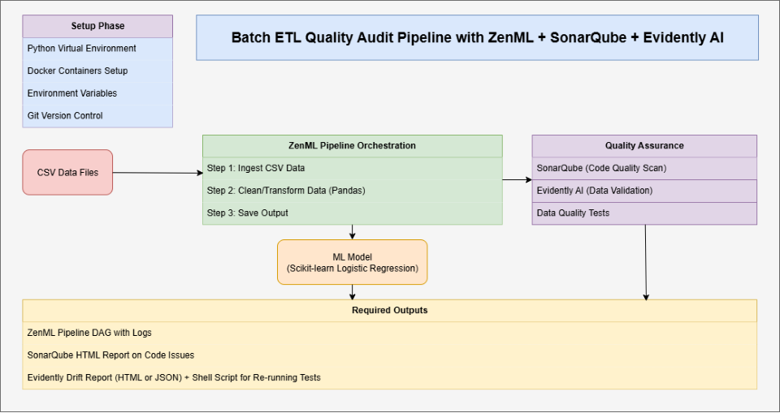

# ETL-Audit-Pipeline

A comprehensive machine learning pipeline built with ZenML for automated data processing, model training, and data drift monitoring using Evidently AI. This project demonstrates best practices for MLOps including containerization, code quality analysis with SonarQube, and continuous monitoring.

## 🚀 Overview

This ETL (Extract, Transform, Load) audit pipeline provides:

- **Automated data ingestion and preprocessing**
- **Machine learning model training and evaluation**
- **Data drift detection and monitoring**
- **Comprehensive reporting with Evidently AI**
- **Code quality analysis with SonarQube**
- **Containerized deployment with Docker**

## 📋 Table of Contents

- [Features](#-features)
- [Architecture](#-architecture)
- [Prerequisites](#-prerequisites)
- [Installation](#-installation)
- [Usage](#-usage)
- [Pipeline Steps](#-pipeline-steps)
- [Data Drift Monitoring](#-data-drift-monitoring)
- [Code Quality Analysis](#-code-quality-analysis)
- [Docker Setup](#-docker-setup)
- [Project Structure](#-project-structure)
- [Configuration](#-configuration)

## ✨ Features

- **ZenML Integration**: Modular pipeline orchestration
- **Data Drift Detection**: Automated monitoring with Evidently AI
- **Model Training**: Scikit-learn based machine learning
- **Quality Assurance**: SonarQube integration for code analysis
- **Containerization**: Full Docker support
- **Monitoring**: Comprehensive reporting and logging
- **Scalability**: Easily extensible pipeline architecture

## 🏗 Architecture



## 📋 Prerequisites

- Python 3.8+
- Docker & Docker Compose
- Git

## 🛠 Installation

### 1. Clone the Repository

```bash
git clone https://github.com/Anurag-Negi28/ETL-Audit-Pipeline.git
cd ETL-Audit-Pipeline
```

### 2. Create Virtual Environment

```bash
python -m venv venv
source venv/bin/activate  # On Windows: venv\Scripts\activate
```

### 3. Install Dependencies

```bash
pip install -r requirements.txt
```

### 4. Setup Data Directory

```bash
mkdir -p data/raw data/processed data/predictions
```

## 🚀 Usage

### Quick Start

1. **Place your data**: Add your input CSV file to `data/input.csv`

2. **Run the pipeline**:

```bash
python run_pipeline.py
```

3. **View results**: Check the `evidently_report/` directory for generated reports

### Running with Docker

```bash
# Build the image
docker build -t etl-audit-pipeline .

# Run the pipeline
docker run -v $(pwd)/data:/app/data etl-audit-pipeline
```

## 📊 Pipeline Steps

### 1. Data Ingestion (`ingest_data_step`)

- Loads data from CSV files
- Validates data structure
- Returns pandas DataFrame

### 2. Data Cleaning (`clean_data_step`)

- Handles missing values
- Removes duplicates
- Performs data validation
- Feature engineering

### 3. Model Training (`train_model_step`)

- Trains machine learning models
- Uses scikit-learn algorithms
- Saves model artifacts

### 4. Model Evaluation (`evaluate_model_step`)

- Calculates performance metrics
- Generates evaluation reports
- Validates model quality

### 5. Prediction Generation (`generate_predictions_step`)

- Applies trained model to data
- Generates predictions
- Saves results to file

### 6. Evidently Report (`evidently_report_step`)

- Generates data drift reports
- Compares reference vs current data
- Creates HTML reports for visualization

## 📈 Data Drift Monitoring

The pipeline uses Evidently AI for comprehensive data drift monitoring:

- **Data Drift Detection**: Identifies changes in data distribution
- **Model Performance Monitoring**: Tracks model quality over time
- **Feature Drift Analysis**: Monitors individual feature changes
- **Visual Reports**: Interactive HTML reports for analysis

### Report Generation

Reports are automatically generated and saved to:

- `evidently_report/report.html` - Main drift analysis report
- `reports/evidently/` - Additional report storage

## 🔍 Code Quality Analysis

### SonarQube Integration

Start SonarQube analysis:

```bash
# Make script executable (Linux/Mac)
chmod +x scan.sh

# Run the scan
./scan.sh
```

This will:

1. Start SonarQube server via Docker Compose
2. Run code analysis on the pipeline
3. Generate quality reports at `http://localhost:9000`

### Manual SonarQube Setup

```bash
# Start SonarQube
docker-compose up -d sonarqube

# Run scanner
docker-compose --profile scan up sonar-scanner
```

## 🐳 Docker Setup

### Full Environment Setup

```bash
# Start all services
docker-compose up -d

# Run pipeline
docker-compose exec etl-pipeline python run_pipeline.py
```

### Individual Services

```bash
# SonarQube only
docker-compose up -d sonarqube postgres

# Pipeline only
docker build -t etl-pipeline .
docker run etl-pipeline
```

## 📁 Project Structure

```
ETL-Audit-Pipeline/
├── src/                     # Source code directory
│   ├── pipeline/           # Pipeline definitions
│   ├── steps/              # Individual pipeline steps
│   ├── config/             # Configuration files
│   └── utils/              # Utility functions
├── tests/                   # Test files
│   ├── unit/               # Unit tests
│   └── integration/        # Integration tests
├── data/                    # Data directories
│   ├── raw/                # Raw input data
│   ├── processed/          # Cleaned data
│   └── predictions/        # Model predictions
├── models/                  # Model artifacts
│   └── artifacts/          # Saved models
├── reports/                 # Generated reports
│   ├── evidently/          # Evidently AI reports
│   └── model_performance/  # Model metrics
├── logs/                    # Application logs
├── docs/                    # Documentation
├── scripts/                 # Utility scripts
├── docker/                  # Docker configurations
├── .github/                 # GitHub workflows
├── pipeline/               # Legacy pipeline (to be migrated)
├── steps/                  # Legacy steps (to be migrated)
├── evidently_report.py     # Evidently AI integration
├── run_pipeline.py         # Main pipeline runner
├── requirements.txt        # Python dependencies
├── Dockerfile             # Container definition
├── docker-compose.yml     # Multi-service setup
├── scan.sh               # SonarQube analysis script
├── sonar-project.properties # SonarQube configuration
└── README.md             # This file
```

## ⚙️ Configuration

### Pipeline Configuration

Key configuration files:

- `requirements.txt` - Python dependencies
- `sonar-project.properties` - SonarQube settings
- `docker-compose.yml` - Service definitions

### Environment Variables

Create a `.env` file for sensitive configurations:

```env
SONAR_TOKEN=your_sonar_token
PROJECT_KEY=your_project_key
DATABASE_URL=your_database_url
```

### ZenML Configuration

Initialize ZenML (first time only):

```bash
zenml init
zenml stack set default
```

## 🔧 Customization

### Adding New Pipeline Steps

1. Create a new step in `src/steps/`:

```python
from zenml import step
import pandas as pd

@step
def your_custom_step(df: pd.DataFrame) -> pd.DataFrame:
    # Your processing logic here
    return processed_df
```

2. Import and add to pipeline:

```python
from src.steps.your_custom_step import your_custom_step

@pipeline
def etl_pipeline():
    # ... existing steps ...
    result = your_custom_step(input_data)
```

### Custom Evidently Reports

Modify `evidently_report.py` to add custom metrics:

```python
from evidently.metric_preset import DataQualityPreset, TargetDriftPreset

# Add to report metrics
Report(metrics=[
    DataDriftPreset(),
    DataQualityPreset(),
    TargetDriftPreset()
])
```

## 🧪 Testing

Run tests:

```bash
# Unit tests
pytest tests/unit/

# Integration tests
pytest tests/integration/

# All tests with coverage
pytest --cov=src tests/
```

## 📊 Monitoring & Logging

- **Pipeline Logs**: Check `logs/` directory
- **Evidently Reports**: View at `reports/evidently/`
- **SonarQube Dashboard**: Access at `http://localhost:9000`
- **Model Artifacts**: Stored in `models/artifacts/`

### Development Guidelines

- Follow PEP 8 style guidelines
- Write unit tests for new features
- Update documentation for API changes
- Run SonarQube analysis before submitting

## 🚀 Roadmap

- [ ] Add support for multiple data sources
- [ ] Implement real-time pipeline monitoring
- [ ] Add model versioning with MLflow
- [ ] Kubernetes deployment manifests
- [ ] Advanced alerting system
- [ ] API endpoint for pipeline triggers

## 🙏 Acknowledgments

- [ZenML](https://zenml.io/) for pipeline orchestration
- [Evidently AI](https://www.evidentlyai.com/) for data drift monitoring
- [SonarQube](https://www.sonarqube.org/) for code quality analysis
- [Docker](https://www.docker.com/) for containerization

---

**Happy ML Engineering! 🚀**
